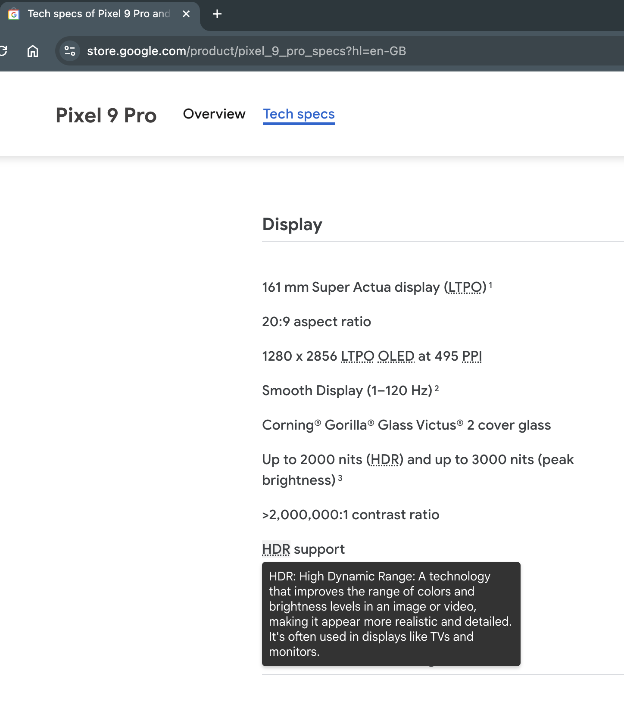

# Acronym Expander with Gemini Nano

A Chrome extension that enhances digital literacy by providing instant, contextual definitions for acronyms and abbreviations on any webpage. This tool leverages Google Chrome's built-in Gemini Nano AI model to dynamically identify, expand, and explain technical terms directly within the browser.

## Table of Contents

- [Inspiration](#inspiration)
- [Features](#features)
- [Built With](#built-with)
- [Installation](#installation)
- [Usage](#usage)
- [Proof of Concept Findings](#proof-of-concept-findings)
- [Research Paper](#research-paper)
- [Contributing](#contributing)
- [License](#license)

## Inspiration

This extension was inspired by a desire to support individuals with limited digital literacy, as explored in my Master's thesis. Many users struggle with technical jargon, and constant searching for definitions can disrupt the learning process. Acronym Expander provides seamless, in-context help, making online content more accessible and understandable.

## Features

- **Real-time Acronym Detection**: Identifies acronyms and abbreviations as you browse.
- **In-Context Definitions**: Hover over any detected acronym to see its expanded form and a brief description.
- **Customizable Settings**: Enable or disable the extension from the options page to suit your browsing experience.
- **Optimized for Accessibility**: Designed to support users with memory or cognitive challenges by providing instant information without interrupting the reading flow.

## Built With

### Languages

- JavaScript
- HTML
- CSS

### APIs

- Chrome Extensions API: Used to manage extension lifecycle, content injection, and settings.
- Google's Gemini Nano AI Model: Provides acronym detection, expansion, and contextual descriptions.

### Tools & Libraries

- Prompt API: For querying Gemini Nano to extract accurate definitions and expansions.
- Regex: Pattern matching for acronym detection.
- DOM Manipulation: Dynamically injects tooltips and highlights into web content.

## Installation

To install the extension from the source code:

1. Clone the repository:

   ```bash
   git clone https://github.com/your-username/acronym-expander.git
   cd acronym-expander
   ```

2. Open Chrome and go to `chrome://extensions/`
3. Enable Developer mode (toggle in the top right corner)
4. Click on "Load unpacked" and select the cloned repository folder
5. The extension will now be available in your browser
6. **Important**: After installation, you must enable the extension:
   - Right-click the extension icon and select "Options"
   - In the "Acronym Expander Settings" page
   - Check the "Enable Acronym Expander" checkbox

## Usage

1. **Enable the Extension**: By default, the extension is enabled. You can toggle it on or off from the extension's options page.
2. **Hover Over Acronyms**: When browsing any webpage, hover over acronyms to see their expanded form and brief description.
3. **Customize Settings**: You can adjust the extension's settings from the options page (accessible by right-clicking the extension icon and selecting "Options").

### Demo Video
Watch the extension in action:

[](https://www.youtube.com/watch?v=ePVaeyRWa3M)

_Click the image above to watch the demo video on YouTube_

### Example Workflow

1. Open any article or website with technical terms. You can test the extension on this page: [Pixel 9 Pro Specs](https://store.google.com/product/pixel_9_pro_specs?hl=en-GB)
2. Hover over an acronym (e.g., "API")
3. The extension will display a tooltip with the full form ("Application Programming Interface") and a short description

### Screenshots


_Screenshot 1: Hovering over "HDR" shows the expanded definition and explanation_


_Screenshot 2: Hovering over "PPI" shows the expanded definition and explanation_


_Screenshot 3: Hovering over "GPU" shows the expanded definition and explanation_


_Screenshot 4: In developer tools console the detected acronyms are logged_

## Proof of Concept Findings

The proof-of-concept tool developed for my thesis demonstrated significant benefits for users with digital literacy challenges:

- **Improved Comprehension**: 80% of users reported better understanding of technical terms with the extension's in-context definitions.
- **Time Efficiency**: 70% of participants saved time by avoiding external searches, enabling a more streamlined reading experience.
- **Enhanced Confidence**: 65% of users felt more confident engaging with complex content due to the simplified, accessible explanations.

These findings highlight the potential of contextual help tools to improve accessibility and comprehension for diverse user groups.

## Research Paper

For a detailed understanding of the research behind this extension, you can read my thesis:
[Contextual help extension for digital illiterate internet users - Christos Koutsiaris [Final].pdf](./Contextual%20help%20extension%20for%20digital%20illiterate%20internet%20users%20-%20Christos%20Koutsiaris%20[Final].pdf)

This paper explores:

- The challenges faced by digitally illiterate users
- The impact of contextual help tools on user comprehension
- Design considerations for accessibility-focused browser extensions
- Empirical findings from user studies

## Contributing

Contributions are welcome! If you have suggestions for improvements or want to fix issues, feel free to create a pull request. Please follow the standard GitHub process:

1. Fork the repository
2. Create a new branch:

   ```bash
   git checkout -b feature-branch
   ```

3. Make your changes and commit:

   ```bash
   git commit -m "Add new feature or fix"
   ```

4. Push to your forked repository:

   ```bash
   git push origin feature-branch
   ```

5. Submit a pull request to this repository
